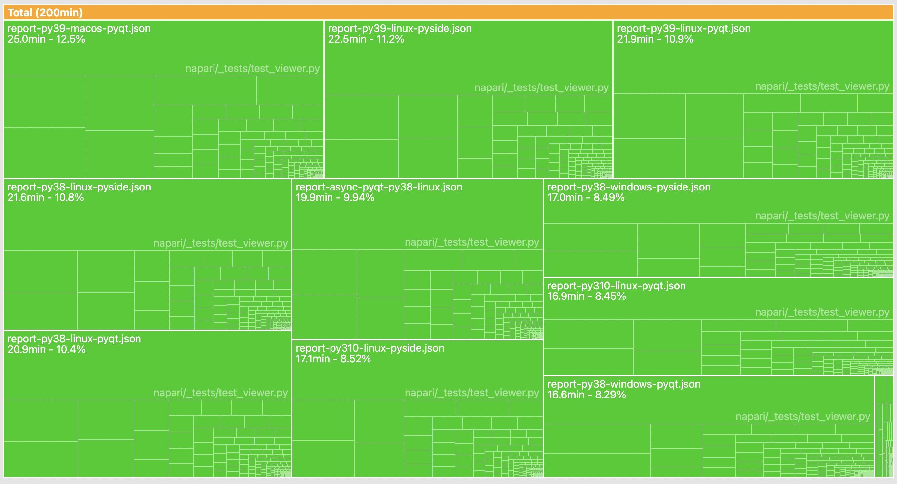

# Pytest Json Report Viewer.

You run Pytest on many github action matrix element. 

You want a breakdown on the elements that take the most time. 

You use pytest with ``--duration`` but it's still hard to distinguish what is slow, especially with parametrized test.

Fear not, this is for you. This will give you a `treemap` breakdown of test durations,
and you can choose how to breakdown the levels, for example you can aggregate time for each tests, 
regardless of GitHub action matrix element. Or decide to look only at parametrized tests.

Here is a screen shot example of napari test suite time breakdown, default view:

Removing the file in which the test are defined, summing across all 11 matrix element of github action,
and adding a breakdown per item in `@pytest.markparametrize`:

